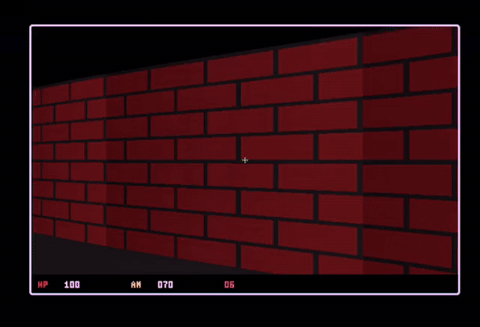

# Revenant




## Run

```
cargo run --release
```

## Controls

### Movement & Aiming
- `W` / `S` — Move forward / backward
- `A` / `D` — Strafe left / right
- `Left` / `Right` — Turn left / right

### Combat & Weapons
- `Space` / `Left Mouse Click` — Fire equipped weapon
- `1` — Equip Assault Rifle
- `2` — Equip Short Gun (Pistol)
- `3` — Equip Knife
- `4` — Equip Grenade
- `Q` — Quick switch between primary Rifle & Short Gun
- `Scroll Wheel Up` / `Down` — Cycle through all weapons
- `V` / `F` / `Right Mouse Click` — Quick melee knife attack
- `G` — Quick throw grenade

### System
- `Esc` — Quit game

Walk into the marked exit tile in the south-west room to clear the level.
Green pickups restore health, yellow pickups restore ammo.

## Asset layout

Runtime art is kept under [`src/gameasset`](src/gameasset/README.md), organized into HUD weapons, world projectiles, actor billboards, and previews.

## Fullscreen / Display

1. **Run the game:**
   ```bash
   cargo run --release
   ```
2. **Maximize / Fullscreen the window:**
   - **Tiling / Hyprland / Sway**: Press your window manager's fullscreen key (e.g. `Super + F` or `Super + M`).
   - **GNOME / KDE / XFCE**: Press `Super + Up` or `Alt + F11` (or click the maximize button).

The viewport and HUD will scale up cleanly to fill your entire screen while preserving the correct retro aspect ratio.
